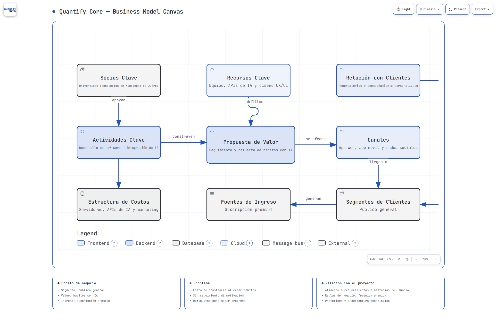

# 📊 Práctica 04 — Modelo Canvas Interactivo

> Business Model Canvas Interactivo del Proyecto Integrador **Quantify Core**, generado con **Archify** y validado con revisión visual automatizada.

## 📝 Descripción

Este documento presenta el **Business Model Canvas del proyecto Quantify Core**, una app de seguimiento y refuerzo de hábitos con IA. El modelo describe cómo la aplicación llega a sus usuarios, qué problema resuelve, qué valor ofrece, qué recursos necesita y cómo genera ingresos. Fue construido de forma colaborativa por el equipo y transformado en un diagrama interactivo con Archify.

  

  

<em>👆 Haz clic en la imagen o en el botón para abrir el canvas interactivo.</em>

## 🔍 ¿Cómo leer este modelo?

- **Lado derecho (mercado):** segmentos de clientes, canales, relación con clientes y fuentes de ingreso. Muestra a quién nos dirigimos y cómo obtenemos dinero.
- **Centro (valor):** la propuesta de valor — seguimiento y refuerzo de hábitos con IA — es el corazón del modelo.
- **Lado izquierdo (operación):** recursos, actividades y socios clave que hacen posible entregar ese valor.
- **Base (finanzas):** la estructura de costos que sostiene el proyecto.
- Cada bloque es **clicable** en la versión interactiva: muestra una ventana con información detallada de ese bloque.

## 🎯 Objetivo

Analizar el contexto del Proyecto Integrador y representar visualmente su propuesta de negocio mediante un Business Model Canvas interactivo creado con Archify, como herramienta de apoyo basada en agentes de IA.

## 🧩 Bloques del canvas

| Bloque | Definición en Quantify Core |
|---|---|
| Segmentos de Clientes | Público general |
| Propuesta de Valor | Seguimiento y refuerzo de hábitos con IA |
| Canales | App web, app móvil y redes sociales |
| Relación con Clientes | Recordatorios y acompañamiento personalizado |
| Fuentes de Ingreso | Suscripción premium (freemium) |
| Recursos Clave | Equipo, APIs de IA y diseño UX/UI |
| Actividades Clave | Desarrollo de software e integración de IA |
| Socios Clave | Universidad Tecnológica de Xicotepec de Juárez |
| Estructura de Costos | Servidores, APIs de IA y marketing |

## 📁 Archivos

- `prompt.txt` — prompt utilizado para generar el modelo con Archify.
- `business-model-canvas.html` — modelo canvas interactivo (modal por bloque, tema claro/oscuro, paleta de marca).
- `business-model-canvas.json` — especificación fuente del modelo.
- `business-model-canvas.visual-check.*` — evidencia de revisión visual automatizada.

## 🌐 Enlaces

- **Página principal del proyecto:** https://jesuuusart.github.io/Quantify-Core/
- **Este modelo canvas:** https://jesuuusart.github.io/Quantify-Core/docs/modelo-canvas/business-model-canvas.html

## 👥 Equipo

Grupo A · 10° Cuatrimestre · Universidad Tecnológica de Xicotepec de Juárez

- Al Farias Leyva
- Francisco García García
- Ángel de Jesús Baños Telles
- Jesús Alejandro Artiaga Morales
